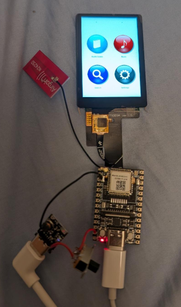
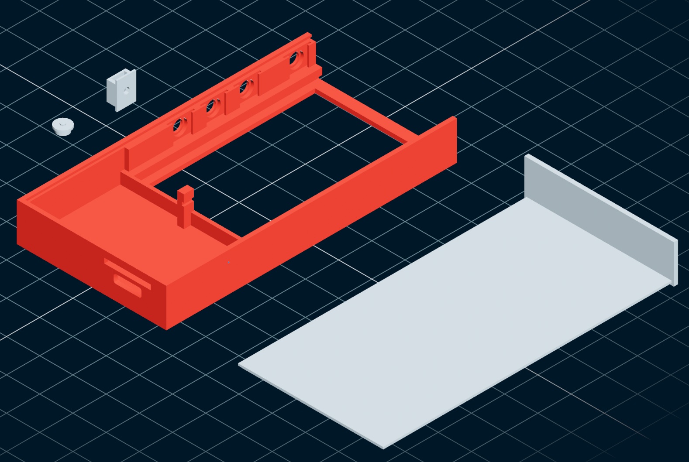

# rust-slint-riscv64-musl-demo
A demo for rust slint on riscv64 musl

# Current status

This project is currently under development and in a very early state. 
It can be compiled for LicheeRV Nano (riscv64-musl), has some fancy Icons, 
navigation works (somehow), dark-mode can be enabled but that's basically it.

Here is how it looks at the moment:




https://github.com/user-attachments/assets/adb3bb52-6b7d-4787-a1df-c830594121e7


And here is a draft for the case:



Planned dimensions are:
- 45.00mm x 88.75mm 11.60mm (w x h x d)
- 1.25mm wall thickness

It is planned that the display slides in where the hole is, the PCBs are
clicked into the empty bottom part and after soldering the wires the
back-cover slides into the rail to close the main case.
To secure the back cover, screw two small screws through the top-plate 
into the display rails (holes for these are planned).

# Prerequisites

## Hardware

- [Sipeed LicheeRV Nano](https://wiki.sipeed.com/hardware/en/lichee/RV_Nano/1_intro.html)
- [Sitronix(?) LHCM228TS003A 2.28" Touch Display](https://b2b.baidu.com/land?id=39559f991fdef58e6c72b9f770bae1d810)
- [Apple USB-C to 3.5 mm Headphone Jack Adapter](https://www.apple.com/shop/product/mw2q3am/a/usb-c-to-35-mm-headphone-jack-adapter)
- Optional - for battery based usage: [5V Version of TP4057 Battery charger board](https://makerselectronics.com/product/lithium-battery-charger-discharge-module-tp4057-lx-lbc3-type-c-usb-1a/) ( 4.2V or 4.35V Versions won't work, too low Voltage)

To connect the USB-Audio Adapter AND power the device, you need to supply power to the VSYS and GND Pin, because you can
not use USB to power the device. 
CAUTION: You need to supply around 5V, the LicheeRV Nano is pretty picky about too low or too high voltages, so be careful, in my tests 5.15V from the TP4057 were ok.

## Firmware-Image

- [LicheeRV Nano Fork by scpcom](https://github.com/scpcom/LicheeSG-Nano-Build/) - download latest `licheervnano-dap_sd.img.xz` and flash via `xzcat licheervnano-e_sd.img.xz | sudo dd of=<your-device> bs=100M status=progress conv=fsync`
- Mount `boot` partition and create / edit the following files
  - `touch fb` - enables framebuffer
  - `echo "panel=st7701_lhcm228ts003a" > uEnv.txt` - enables the display
  - `rm usb.dev && touch usb.host` - enable USB host mode to support USB-Audio-Adapters
  - Create `wpa_supplicant.conf`
    ```
    ctrl_interface=/var/run/wpa_supplicant
    ap_scan=1
    network={
        ssid="<YOUR SSID>"
        psk="<YOUR PSK>"
    }
    ```


# How to build for LicheeRV Nano

First you need  `docker` to be installed on your system - the `cross` crate will take care of the rest.

After checking out the repository and using `cargo` to update all dependencies, it should be enough to execute

```bash
./build-cross.sh
```

The script `copy-lichee.sh` will `scp` the binary to `lichee:/root`, which can be easily modified to match your DNS configuration. After 
copying the binary over, it can simply be run via SSH.

**Important:** You need to ensure to have a USB-Audio Adapter connected (see [Prerequisites](#Prerequisites))

By typing `./rust-slint-riscv64-musl-demo` the demo should be visible on the screen.

# Development

The project development happens on Linux, because the LicheeRV also operates on Linux and has some hard dependencies 
(like `alsa` for audio and `framebuffer` for graphics). It might be possible to run it on other systems, but it is clearly
NOT RECOMMENDED to do so.

Using Linux you should easily be able to just run the project via

```bash
cargo run
```

That's it for now, more to come.


# Goals
- Create an Open Source audio player inspired by the iPod Nano 7g
- Very tiny size (max 45x80x18mm)
- At least 5h of battery / listening time
- Not too challenging obtaining and assembling the hardware (beginner soldering skills, 3D printer access)
- Easily Repairable (replaceable battery, microSD-Card, LCD and Board, 3D printable case)
- Touchscreen controls including gestures (swipe, etc.)
- Playback controls via headphone remote and push-buttons (tap / hold actions for volume, play, pause, next, previous, fast-forward, rewind)
- Wifi and bluetooth connectivity 
- Support for common formats (`flac`, `mp3`, `m4a/m4b`, `wav`)
- Syncable audio database (don't do the file and metadata scanning on the device to save CPU, RAM and battery as well as not having to expose the microSD)
- Desktop-deployable UI for easier development and testing (Linux / Rust / Slint based)
- Later
  - Support for Wifi sync
  - Support for Bluetooth audio
  - Support for WASM Plugins (see [zellij](https://zellij.dev/))

# Challenges
- Onscreen Keyboard on a tiny device (maybe voice input or T9 based text input options?)
- Optimize Battery time (CPU clock, sleep modes, backlight intensity, etc)

# Roadmap / Todo
- [x] Find suitable Hardware (Board, Display, Audio)
- [x] Compile and run basic test application in Rust / Slint
- [ ] 3D Design a case for housing the components and a battery >= 1500mah
  - [x] Create the basic case design
  - [ ] Add Shims for TP4057 5V and MAX17043
  - [ ] Position TP4057 USB-C creating a bottom hole 
  - [ ] Position MAX17043 JST 2.0 facing upwards for connecting the 1600mah battery
- [ ] Compose the hardware components
  - [x] Make a breadboard draft
  - [ ] Test the button GPIO connections
  - [ ] Test MAX17043 I2C connection and readout
  - [ ] Test Headphone-remote controls
- [ ] Implement the DAP software for the embedded device
  - Next Steps
    - [ ] Store media items to database
    - [ ] Improve display of media items
    - [ ] Load preferences on app start
    - [ ] Sync preferences to DB when changed
    - [ ] Extend schema to store media-progress for items > 15 minutes
      - Idea: 
        - Play-Action checks last update for media-progress
        - a new playback session id is generated if
          - Last update is older than 30 minutes
          - Another item has been played
        - otherwise playback session is "resumed" and does not store a new history / media-progress item, but updates the current one
        - Table: Playback_history
          - id (int)
          - item_id (int)
          - session_id(string) // randomly generated
          - date_modified(DateTime)
          - position (float)
    - [ ] Fix DB Migration issue
- [ ] Implement the Sync software for the Desktop / Mobile devices


# Slint

## Questions
- [ ] Where is the reference of the offical elements?
- [ ] How would I achieve an overlay display (e.g. for Volume or Brightness
- [ ] Swipe Gestures
  - How can I have a slider and swipe gestures in the same layout without interference
  - Would it be possible to "animate" swipe gestures with sliding in and sliding out depending on the direction?

## Issues / Improvements
- [ ] image can't be checked conditionally in components (if image.is-present: Image {})
- [ ] There is no Template Component option (ListView { template: MyCustomComponent})
- [ ] GridLayout does not support for loops
- [ ] Swipe Gesture Handler makes using sliders impossible #6781
- [ ] Async is not supported #4377
- [ ] ScrollView has a margin right, regardless of showing scrollbar or not
- [ ] Element sizes can not be scaled (e.g. Slider or Checkbox)
- [ ] Something is wrong with the LCD Color, it may be the driver or slint
- [ ] Inertial scrolling

# Notes
- Routing: https://github.com/slint-ui/slint/discussions/6783
- Swipe: https://docs.slint.dev/latest/docs/slint/reference/gestures/swipegesturehandler/
- Rust mutable struct fields: https://stackoverflow.com/questions/27022848/how-i-can-mutate-a-structs-field-from-a-method


# Tags

This is a good overview of existing audio tags: https://docs.mp3tag.de/mapping/


# SQL Database


## Datatypes

- NULL. The value is a NULL value.
- INTEGER. The value is a signed integer, stored in 0, 1, 2, 3, 4, 6, or 8 bytes depending on the magnitude of the value.
- REAL. The value is a floating point value, stored as an 8-byte IEEE floating point number.
- TEXT. The value is a text string, stored using the database encoding (UTF-8, UTF-16BE or UTF-16LE).
- BLOB. The value is a blob of data, stored exactly as it was input.

> Note: There is no "DATE" type. It can be stored as a TEXT (iso date format), INTEGER (timestamp) or REAL (Julian Day Number). For more details see https://sqlite.org/lang_datefunc.html

## Enum columns
See https://www.sea-ql.org/sea-orm-cookbook/005-selct-row-matching-any-enum-values.html

## Raw sql
See https://www.sea-ql.org/sea-orm-cookbook/018-raw-and-unprepared.html:q

## Schema (draft)

- Items - list of all files in the file system
  - id (int)
  - media_type (int)
  - name (string)
  - modified (string)
- ItemsMetadata - audio metadata assigned to items
  - id (int)
  - item_id (int)
  - tag (int)
  - value (string)
  - modified (string)
- ItemJsonMetadata - audio metadata containing non-searchable long text / json (e.g. chapters)
  - id (int)
  - item_id (int)
  - tag (int)
  - value (text)
  - modified (string)
- Pictures - references to pictures stored in the filesytsem (<base-dir>/.cache/)
  - id (int)
  - file_location (string)
  - hash (string)
  - modified (string)
- ItemPictures - m to n references for pictures stored in files
  - item_id (int)
  - picture_id (int)
- Log - action log for files (e.g. play, pause, sleeptimer, etc) - will probably also store the current position and the playback history
  - id (int)
  - action (string)
  - position (real?)
  - modified (string)
- Settings - store all settings (e.g. key=appearance.enable_dark_mode, value=true)
  - id (int)
  - key (string)
  - value (string)

